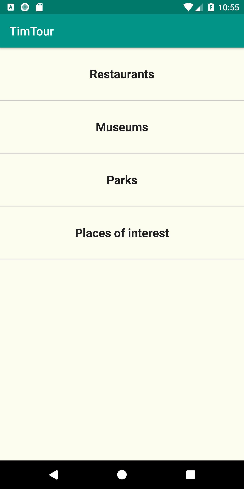
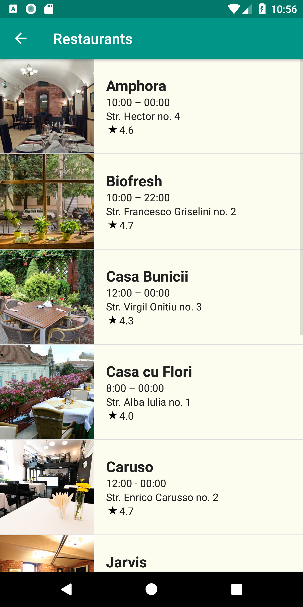
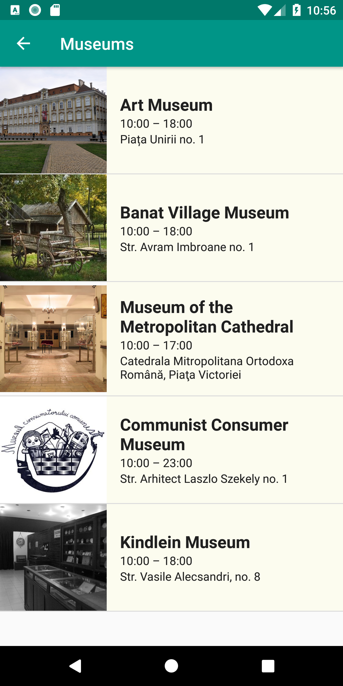
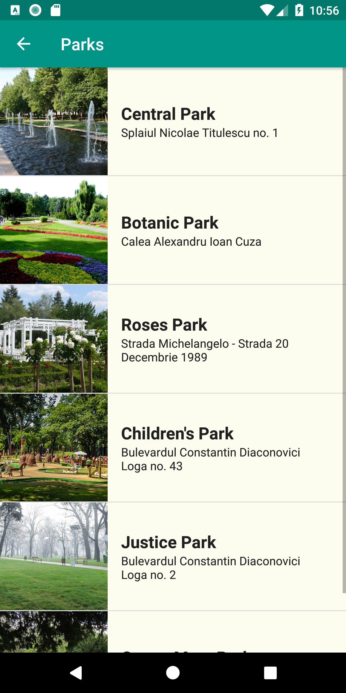
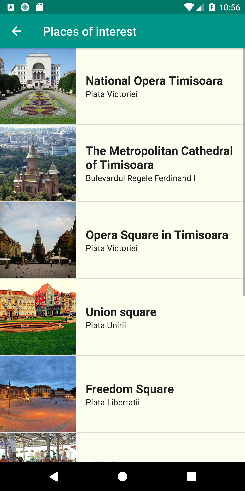

# TimTour
A tour app for the city of Timisoara.

## Description
An app which shows you the main attractions in the city of Timisoara.
In this project which is part of the Udacity Android Basics program, I learned how to make multi-screen apps and how to use custom adapters to pupulate a layout.

## Screenshots
   

 
